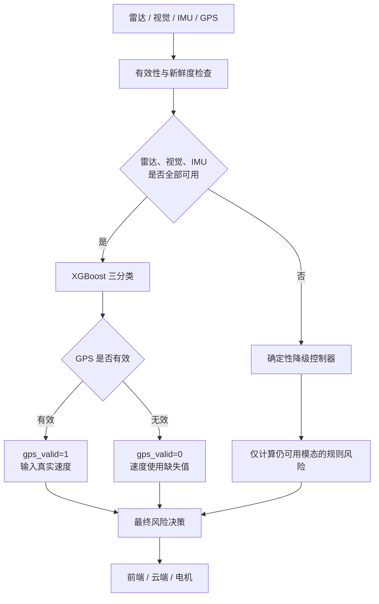

# XGBoost 风险模型与系统降级修改总结

> 文档状态：代码修改与软件回归测试已完成，DK-2500 真实传感器拔插、真实电机和整机端到端延迟仍待实机验收。
> 适用入口：`run_xgb_dashboard.py`
> 决策架构：XGBoost 正常决策 + 确定性单传感器降级

## 1. 修改背景

系统的正常风险模型已经从旧版确定性规则切换为三分类 XGBoost，输出低风险、
中风险和高风险。切换后发现了几个需要修复的问题：

1. 传感器失效后，XGBoost 仍可能使用失效前的历史特征；
2. IMU 拔出后，前端仍可能显示非零 IMU 贡献；
3. 室内 GPS 长期无定位，需要系统在 `gps_valid=0` 时仍可正常工作；
4. 单个核心传感器失效时，电机不能因为“所有传感器必须正常”的门禁而被强制静默；
5. 视觉风险不应依赖行人、车辆等类别，应统一按路径内障碍物处理；
6. 前端和云端已有字段不能因修复而破坏。

本次修改的目标不是让 XGBoost 学会所有可能的传感器组合，而是建立清晰的两层架构：

- 正常状态由 XGBoost 负责；
- 单个核心传感器失效时，使用原有确定性阈值规则和其余有效传感器继续输出。

## 2. 最终决策架构



这里的核心传感器是：

- 雷达；
- 视觉；
- IMU。

GPS 是速度上下文，不是独立报警源。GPS 单独失效不会触发规则降级，系统仍使用
XGBoost。

## 3. XGBoost 特征修改

### 3.1 新增 GPS 有效性

模型新增：

```text
gps_valid
```

运行时输入规则：

| GPS 状态 | `gps_valid` | `gps_speed_kmh` |
|---|---:|---:|
| 有效且速度正常 | 1 | 实际速度 |
| 有效且速度为零 | 1 | 0 |
| 无定位或数据失效 | 0 | 缺失值 |

GPS 无效时不再用 `0 km/h` 冒充车辆静止。这使模型能够区分：

- GPS 正常且车辆确实静止；
- GPS 无效，无法获得可信速度。

### 3.2 视觉类别无关

从模型特征中删除：

```text
radar_person_matched
target_is_person
target_is_vehicle
target_is_obstacle
```

风险判断只关心：

- 障碍物是否位于骑行路径内；
- 障碍物在画面中的接近程度；
- 检测框是否持续增大；
- 视觉碰撞时间 `visual_tau_s`；
- 雷达目标是否位于路径门限内；
- 雷达目标是否接近及其 TTC。

因此，共享单车、行人、汽车或其他障碍物只要具有相同的位置、运动和接近特征，
就会得到一致的风险输入。原始检测类别仍可用于画框展示，但不再作为 XGBoost 风险特征。

### 3.3 最终特征数量

删除 4 个类别相关特征并新增 1 个 `gps_valid` 后，当前模型共有 28 个输入特征：

- GPS：2 项；
- IMU：11 项；
- 雷达：7 项；
- 视觉：8 项。

## 4. GPS 有效但速度为零时的处理

GPS 有效且速度为零时，模型输入为：

```text
gps_valid = 1
gps_speed_kmh = 0
```

这不会直接把整体风险设为零。XGBoost 仍然使用雷达、视觉和 IMU 特征：

- 雷达目标主动接近且 TTC 很小，仍可判定为高风险；
- 视觉路径内障碍物快速变大，仍可判定为中风险或高风险；
- IMU 出现冲击、明显加速度变化或持续侧倾，仍可报警；
- 所有模态均平稳时，才倾向低风险。

IMU 的高速侧倾紧急分支需要速度至少为 `3 km/h`。速度为零时不会启用该分支，
目的是减少静止扶车、搬车时的强烈误报；普通侧倾和冲击风险仍可生效。

当前系统尚未自动识别“GPS 声称有效，但车辆实际运动且速度长期错误为零”的异常。
这个问题不会让雷达和视觉失效，但可能削弱依赖速度的 IMU 判断，属于后续实车数据
一致性检查范围。

## 5. 确定性降级控制器

新增 `SingleSensorDegradationController`，复用以下既有规则阈值：

- 雷达 TTC 与路径门限规则；
- 视觉路径、接近程度与视觉 tau 规则；
- IMU 横向失稳规则。

降级控制器只计算当前仍然可用的模态，失效模态的结果为：

```text
score = null
level = null
status = unavailable
```

它不会把“无数据”伪装成“风险为零”。

### 5.1 降级场景

| 状态 | 最终决策 |
|---|---|
| 只有 GPS 无效 | XGBoost，`gps_valid=0` |
| IMU 无效 | 雷达 + 视觉确定性规则 |
| 雷达无效 | 视觉 + IMU确定性规则 |
| 视觉无效 | 雷达 + IMU确定性规则 |
| 核心传感器恢复 | 先保持规则降级，稳定后切回 XGBoost |

### 5.2 恢复防抖

核心传感器恢复后不会立即切回 XGBoost，而是要求连续稳定：

```text
1.0 秒
```

按照当前 `20 Hz` 状态循环计算，即连续 20 个健康样本。这样可以避免串口或视觉管线
在恢复边缘反复出现：

```text
XGBoost → 规则降级 → XGBoost → 规则降级
```

危险风险仍由降级规则持续处理，这 1 秒只延迟决策引擎的切回，不会停止风险输出。

### 5.3 历史状态清理

IMU 或视觉失效时会清除对应时间窗口：

- IMU 加速度历史；
- IMU 侧倾持续时间；
- IMU 紧急连续样本计数；
- 视觉检测框增长历史；
- 视觉 tau 历史；
- 视觉目标跟踪状态。

这样可以防止重新插入传感器后，把失效前的旧样本与新样本错误拼接。

## 6. 电机控制修改

旧门禁逻辑要求雷达、视觉和 IMU 全部处于 `active`，因此任意一个传感器被拔出后，
即使其他传感器已经检测到危险，电机也会被关闭。

修改后的逻辑是：

### 正常 XGBoost 模式

需要满足：

- 特征窗口完成预热；
- XGBoost 预测可用；
- 模型置信度达到配置要求。

### 确定性降级模式

不再要求所有核心传感器同时正常，也不依赖 XGBoost 置信度。只要降级控制器能够从
剩余传感器产生有效风险决策，电机就可以接收该决策。

对应门禁原因示例：

```text
xgboost_prediction_accepted
degraded_rule_prediction_accepted
fallback_recovery_prediction_accepted
fallback_decision_unavailable
```

这里的“安全门”不再等于“传感器失效就静默”，而是保证只有有效的 XGBoost 或
有效的确定性降级结果可以驱动电机。

## 7. 前端与云端兼容

原有前端和云端主要字段保持不变，包括：

```text
risk_score
risk_level
risk_label
radar_score
vision_score
imu_score
gps_score
radar_level
vision_level
hardware_status
prediction
features
modules
motor
```

新增状态字段：

```text
decision_engine
decision_source
degraded
missing_sensors
degradation
```

典型值为：

```text
decision_engine = xgboost-with-deterministic-degradation
decision_source = xgboost
decision_source = deterministic_fallback
decision_source = deterministic_fallback_recovery
```

失效传感器的前端贡献显示为 `--`，不再展示拔出前的 TreeSHAP 残留贡献。降级状态下，
可用模态展示的是确定性规则评分，而不是将其误称为 XGBoost TreeSHAP 贡献。

云端仍使用原有风险、传感器有效性和状态字段。只有存在非空最终风险等级和分数时才
上传风险样本。

## 8. 数据集与模型重训

因为新增了 `gps_valid`，旧模型的输入结构已经变化，所以本次进行了重新训练。

训练数据共 7,500 条：

| 数据集 | 样本数 |
|---|---:|
| 训练集 | 5,250 |
| 验证集 | 1,125 |
| 测试集 | 1,125 |

GPS 是否有效与风险场景独立生成。约 30% 的样本设置为：

```text
gps_valid = 0
gps_speed_kmh = 缺失
```

低、中、高风险均包含 GPS 无效样本，避免模型错误学习成“GPS 一失效就是低风险”。

### 8.1 模型指标

| 指标 | 验证集 | 测试集 |
|---|---:|---:|
| Accuracy | 99.29% | 99.11% |
| Macro F1 | 99.30% | 99.16% |
| 高风险召回率 | 98.93% | 99.29% |
| 高风险误判为低风险 | 0 | 0 |

单独检查测试集中的 GPS 无效样本：

| 项目 | 结果 |
|---|---:|
| GPS 无效样本数 | 333 |
| 分类准确率 | 99.40% |

模型冒烟测试：

| 项目 | 结果 |
|---|---:|
| 抽样数 | 150 |
| 准确率 | 99.33% |
| 平均推理时间 | 约 0.73 ms |
| 特征数 | 28 |

这些指标衡量的是模型对合成规则标签的拟合能力，不代表真实道路上的泛化准确率。
真实道路结论仍需要实车采集和人工标注数据。

## 9. 已完成的软件验证

以下测试已经通过：

- XGBoost 模型冒烟测试；
- 28 项特征顺序与模型元数据一致性测试；
- 视觉类别无关回归测试；
- GPS 无效测试集推理检查；
- 单核心传感器降级测试；
- GPS 无效且视觉失效时的雷达高风险测试；
- 失效 IMU 不输出零风险伪贡献测试；
- 原有多模态确定性规则测试；
- Dashboard 状态兼容测试；
- 云端上传字段兼容测试；
- Python 语法检查；
- Git 空白与补丁格式检查。

## 10. 尚待实机验证

以下内容不能用当前软件测试结果替代：

1. DK-2500 上真实雷达、IMU、GPS 和视觉的连续运行；
2. 室内 GPS 无定位情况下的长时间稳定性；
3. 拔出 IMU、雷达或关闭视觉后的真实状态切换；
4. 传感器恢复后 1 秒防抖是否符合实际串口恢复特性；
5. 真实 DRV2605 是否按降级决策振动；
6. 视觉结果复制对 DK-2500 CPU、内存和帧率的影响；
7. 感知样本到 DRV2605 `GO` 写入完成的端到端 P95/P99；
8. 马达机械起振和骑手实际感知时间；
9. 多个核心传感器同时失效时的安全能力；
10. 真实道路数据上的误报率、漏报率和高风险召回率。

当前正式承诺范围应限定为：

> GPS 单独失效时继续使用 XGBoost；雷达、视觉或 IMU 单个失效时，系统使用其余
> 可用传感器和确定性规则继续输出。多个核心传感器同时失效暂不作为已验证能力。

## 11. 端到端延迟测量建议

不能把约 `0.73 ms` 的 XGBoost 推理时间称为整机端到端延迟。正式测量应使用同一
主机单调时钟记录：

| 时间点 | 定义 |
|---|---|
| T0 | 雷达/IMU 数据到达主机，或摄像头帧采集完成 |
| T1 | 特征处理或视觉推理完成 |
| T2 | 最终风险决策产生 |
| T3 | DRV2605 `GO` 写入完成 |

计算：

```text
sensor_to_processing_ms = T1 - T0
processing_to_decision_ms = T2 - T1
decision_to_go_ms = T3 - T2
e2e_latency_ms = T3 - T0
```

雷达、视觉、IMU应分别统计样本数、均值、P50、P95、P99和最大值。整机指标采用三条
链路中最大的 P95，同时保留每条链路的独立结果。

当前 XGBoost 运行入口尚未完整记录 T0 至 T3，特别是没有形成可用于正式统计的真实
`GO` 写入记录。因此端到端延迟仍属于“测试方案已确定，埋点和实机测量待完成”。

## 12. 主要修改文件

| 文件 | 修改内容 |
|---|---|
| `run_xgb_dashboard.py` | 接入降级状态机、恢复防抖、最终决策、电机和状态输出 |
| `src/fusion/single_sensor_degradation.py` | 新增确定性单传感器降级控制器 |
| `src/fusion/vision_warning_rule.py` | 增加历史重置并使目标跟踪类别无关 |
| `src/risk_ml/feature_window.py` | 新增 `gps_valid`、无效值处理和历史清理 |
| `src/risk_ml/predictor.py` | 更新 28 项特征与模态映射 |
| `src/risk_ml/dashboard_compat.py` | 保持旧字段并适配最终决策与降级状态 |
| `src/risk_ml/server.py` | 正确展示降级决策和失效模态 |
| `configs/xgb_runtime.yaml` | 增加 1 秒恢复稳定时间 |
| `scripts/risk_ml/generate_synthetic_risk_dataset.py` | 生成跨风险等级的 GPS 无效样本 |
| `models/xgboost_risk/` | 保存重新训练后的模型和元数据 |
| `data/xgb/` | 保存重新生成的数据、字典、规则和 QA 报告 |
| `tests/test_single_sensor_degradation.py` | 新增降级回归测试 |

## 13. 专家可能提问与回答

### 问题 1：为什么不让 XGBoost 自己处理所有传感器失效？

当前训练集没有覆盖所有真实硬件失效时序，也没有足够真实道路标注数据。直接让模型
外推会缺少可解释的安全边界。单传感器失效时使用确定性规则，可以明确知道使用了哪些
传感器和阈值，也不需要在时间紧张时构造大量失效组合重新训练。

### 问题 2：这是不是退回旧版规则？

不是整体退回。正常情况下仍然使用 XGBoost，只有雷达、视觉或 IMU 单个失效时才临时
使用旧阈值规则。传感器恢复稳定后自动切回 XGBoost。

### 问题 3：GPS 在室内一直失效，系统还能运行吗？

可以。GPS 单独失效时输入 `gps_valid=0`，速度使用缺失值，XGBoost 继续根据雷达、
视觉和 IMU 推理。训练集中低、中、高风险都包含 GPS 无效样本。

### 问题 4：GPS 无效后为什么不直接进入旧规则？

GPS主要提供速度上下文，雷达、视觉和 IMU 才是核心风险模态。模型已经接受过 GPS
无效样本训练，因此 GPS 单独失效时没有必要放弃 XGBoost。

### 问题 5：GPS 有效但速度为零，会不会永远判低风险？

不会。速度为零只表示 GPS 认为车辆静止。雷达目标接近、视觉障碍物逼近、IMU 冲击
或侧倾仍可产生中高风险。只有其他模态也平稳时才倾向低风险。

### 问题 6：如果 GPS 明明有效但错误输出零速怎么办？

当前系统还没有完成零速合理性检测。这可能影响依赖速度的 IMU 紧急侧倾分支，但雷达
和视觉仍然有效。后续可以根据 IMU 持续运动证据判断 GPS 零速是否可信，并临时按
`gps_valid=0` 处理；该策略需要实车验证。

### 问题 7：拔掉 IMU 后，为什么前端以前还有 IMU 贡献？

TreeSHAP 解释来自最近一次 XGBoost 预测。如果没有主动屏蔽和清空历史，前端会继续
展示旧贡献。本次修改在 IMU 失效时清理历史，并将其业务贡献显示为 `--`。

### 问题 8：为什么失效贡献显示为 `--`，而不是 0？

0 表示“测量有效，但风险为零”；`--` 表示“没有可信测量，无法计算”。两者语义不同，
将失效值写成 0 会让用户误以为传感器正常且没有风险。

### 问题 9：共享单车会触发报警吗？

只要共享单车位于骑行路径内并呈现明显接近趋势，视觉或雷达特征就会触发风险。风险
判断不再依赖它被分类为 bicycle、person 或 car。

### 问题 10：为什么仍保留原始类别字段？

类别可用于前端画框、调试和数据分析，但不参与 XGBoost 风险判断。这样既不破坏前端
展示，又避免类别误识别直接改变安全决策。

### 问题 11：单个传感器失效后电机会不会被强制关闭？

不会因为“单个传感器不 active”这一条件直接关闭。只要其余有效模态能够产生合法的
确定性降级结果，电机门禁会接受该结果。

### 问题 12：如果所有传感器都失效，电机怎么办？

没有有效证据时不能构造可信风险决策。当前工作只承诺单个核心传感器失效，不把多个
核心传感器同时失效作为已验证能力。真实系统应明确报告不可用状态，而不是伪造安全值。

### 问题 13：恢复为什么要等待 1 秒？

串口和视觉管线恢复时可能短暂抖动。如果立即切回模型，系统可能在模型和规则之间来回
切换。1 秒稳定窗口用于确认恢复可靠，期间降级规则仍持续输出。

### 问题 14：新增 `gps_valid` 为什么需要重新训练？

XGBoost 模型的特征数量和顺序是固定的。新增输入后，旧模型无法正确解释新的特征结构。
因此必须重新生成数据、更新特征元数据并训练 28 特征模型。

### 问题 15：99%以上的准确率是否代表真实道路也有99%？

不代表。当前标签来自确定性规则，指标表示模型在合成测试场景中复现规则的能力。真实
道路泛化性能必须通过真实骑行数据、人工标注、误报和漏报统计验证。

### 问题 16：为什么测试集高风险没有直接误判成低风险？

测试集混淆矩阵中，高风险样本只出现少量高风险到中风险的误差，没有高风险到低风险。
这是当前合成测试集结果，不能外推为真实道路上的绝对保证。

### 问题 17：降级规则会增加多少延迟？

规则计算本身很轻量，正常模式也不会执行降级规则。更可能影响延迟的是视觉结果复制、
视觉推理负载和当前 `2 Hz` 风险/电机更新周期。必须在 DK-2500 上测量完整 T0 到 T3
的 P95/P99，不能只报告模型推理时间。

### 问题 18：前端接口是否发生破坏性变化？

没有删除或改名原有主要字段。新增字段用于说明决策来源和缺失传感器，旧前端仍可读取
原字段；更新后的前端会进一步正确展示降级状态和不可用贡献。

### 问题 19：确定性规则与 XGBoost 输出如何比较？

正常模式展示 XGBoost 的三分类结果和 TreeSHAP 贡献；降级模式展示确定性规则产生的
最终等级和各有效模态规则分数。两者共享原有风险等级字段，但不会把规则分数伪装成
TreeSHAP 解释。

### 问题 20：答辩时应该如何概括这套设计？

建议表述为：

> 系统正常状态使用28项实时特征的三分类XGBoost。针对室内GPS无定位，模型显式输入
> GPS有效性并在无GPS速度时继续推理；当雷达、视觉或IMU单个失效时，系统使用其余
> 可用模态和确定性阈值规则继续输出，并在传感器连续恢复稳定后切回XGBoost。该设计
> 在保持前端和电机输出连续性的同时，避免将失效数据误当成零风险。

## 14. 结论

本次修改解决了以下关键问题：

- GPS 室内无定位时仍能运行 XGBoost；
- GPS 无效与真实零速得到明确区分；
- 单个核心传感器失效时系统仍有确定性输出；
- 电机不会因为单个传感器失效被无条件静默；
- 前端不再显示失效模态的残留贡献；
- 视觉风险不再依赖目标类别；
- 传感器恢复具有防抖和历史清理；
- 模型、数据、元数据和接口保持一致。

软件架构和回归测试已经完成，但正式答辩中的真实硬件延迟、真实道路准确率和拔插效果
必须使用 DK-2500 实机测试结果，不应使用合成数据指标代替。
